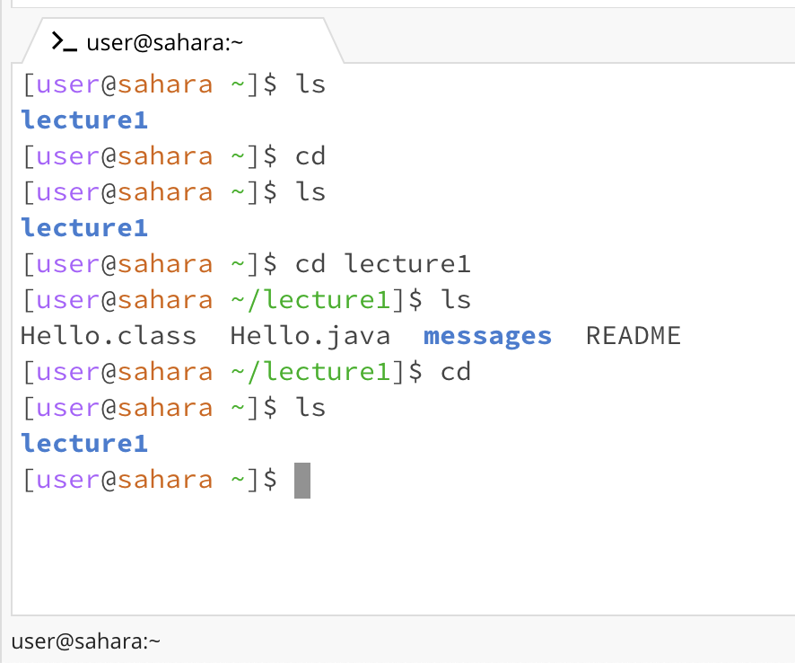

**for the command cd**
1. Share an example of using the command with no arguments.

in this picture, if we use the command cd with no arguments, it will return back to the previous directory. For instance, after we change directory into lecture1, we type cd to get back to home.

2. Share an example of using the command with a path to a directory as an argument.
