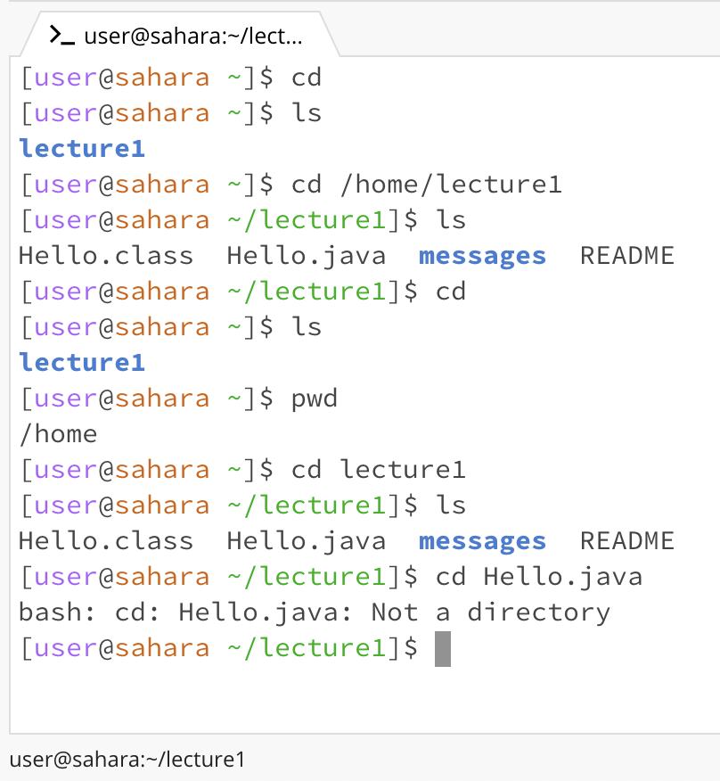

**for the command cd**



```
1. Share an example of using the command with no arguments.
In the screenshot, the working directory starts at the home directory. If we use the command cd with no arguments,
meaning if we just type "cd" into the command line, it will do nothing and stays at the home directory, however
if we are in other directory, then using the command cd with no arguments will return back to the previous directory.
For instance, after we change directory into lecture1, we type cd to get back to the home directory.

2. Share an example of using the command with a path to a directory as an argument.
Using the example from above, when I type "cd /home/lecture1", which is a path to the "lecture1" directory,
the terminal directed me to the lecture1 directory, which contains Hello.class, Hello.java, messages, and README.

3. Share an Example of using the command with a path to a file as an argument.
Again, using the same screenshot for the cd example, when I type "cd Hello.java" while in the lecture1 directory,
which means I'm trying to change my directory to this java file called Hello, the terminal return an error of
"bash: cd: Hello.java: Not a directory" because Hello.java is not a directory, so cd, which stands for change
directory, won't work.
```
**for the command ls**


```
```

