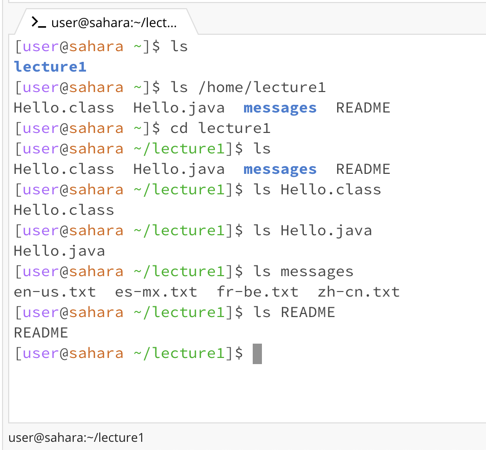

**for the command cd**


```
1. Share an example of using the command with no arguments.
In the screenshot, the working directory starts with the home directory. If we use the command cd with no arguments,
meaning if we just type "cd" into the command line, it will do nothing and stays at the home directory, this is not
an error because there is nothing to change for the directory, you are in the home directory which is like the base
of the directory. However if we are in other directory, then using the command cd with no arguments will return back
to the previous directory. For instance, after we change directory into lecture1, we type cd to get back to the home
directory.
```
```
2. Share an example of using the command with a path to a directory as an argument.
Using the example from above, start with the home directory, when I type "cd /home/lecture1", which "/home/lecvture1"
is a path to the "lecture1" directory, the terminal directed me to the lecture1 directory, which contains Hello.class,
Hello.java, messages directory, and README. This is not an error.
```
```
3. Share an Example of using the command with a path to a file as an argument.
Again, using the same screenshot for the cd example, when I type "cd Hello.java" while in the lecture1 directory,
which means I'm trying to change my directory to this java file called Hello, the terminal return an error of
"bash: cd: Hello.java: Not a directory" because Hello.java is not a directory, so cd, which stands for change
directory, won't work.
```
**for the command ls**


```
1. Share an example of using the command with no arguments.
In the example provided on the top, the working directory starts with the home directory. If we use the command ls
with no arguments, meaning if we just type "ls" into the command prompt, the terminal will output all the elements
in the current directory. In this case of the home directory, the only element is the directory lecture1. This is not
an error.
```
```
2. Share an example of using the command with a path to a directory as an argument.
When I type "ls /home/lecture1" into the command prompt at the starting directory as the home directory, which
"/home/lecture1" is the path to the "lecture1" directory, the terminal will output all the elements from that
directory, which in this case the directory "lecture1" have Hello.class, Hello.java, messages directory, and
README. This is not an error.
```
```
3. Share an Example of using the command with a path to a file as an argument.
The starting directory is the lecture1 directory, if I type in "ls Hello.java", "ls Hello.class", "ls README",
which all of them are files, then it will just repeat the name of the file. The terminal did not return an error
to this problem because the only elements in these files that the terminal can "list" is the file itself.
ls stands for list by the way.
```
**for the command cat**

```
1. Share an example of using the command with no arguments.
```
```
2. Share an example of using the command with a path to a directory as an argument.
```
```
3. Share an Example of using the command with a path to a file as an argument.
```
